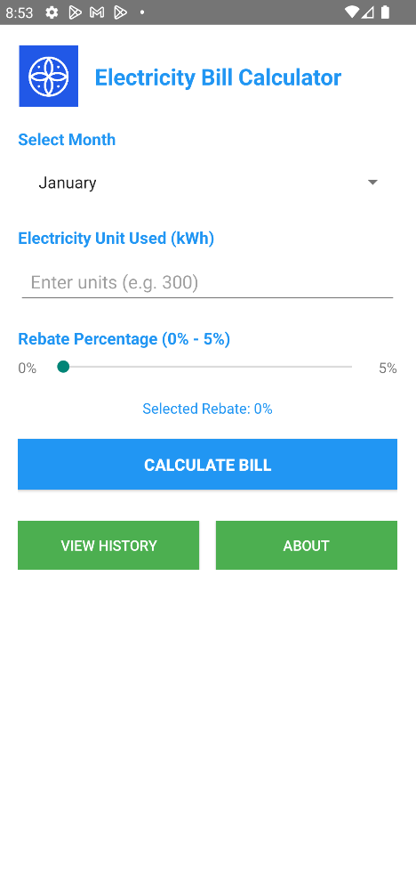
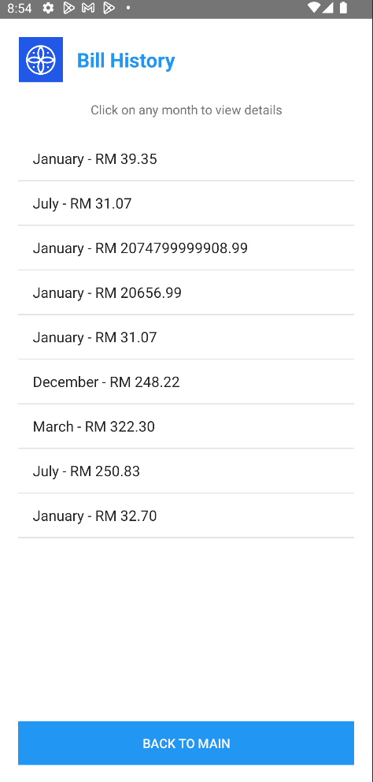
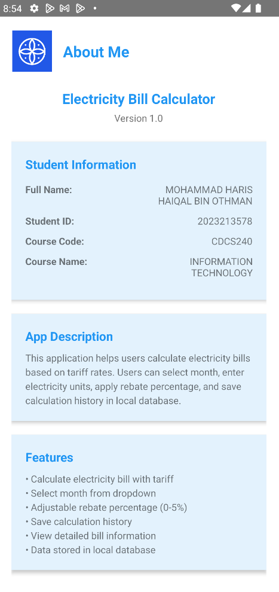

#  Electricity Bill Calculator 

Android application for calculating monthly electricity bills. Developed for ICT602 Mobile Technology assignment.

##  Features
- **Calculate Electricity Bill**
- **Month Selection** (January - December)
- **Adjustable Rebate** (0% - 5%)
- **Local Database Storage** using SQLite
- **Detailed View**
- **User-Friendly Interface**

##  Architecture
- **Language**: Java
- **Minimum SDK**: API 21 (Android 5.0)
- **Database**: SQLite (Local/Offline)
- **Architecture**: MVC Pattern
- **Tools**: Android Studio, Git, GitHub

##  Tariff Calculation Method
| Block | Rate (sen/kWh) |
|-------|----------------|
| 1-200 kWh | 21.8 |
| 201-300 kWh | 33.4 |
| 301-600 kWh | 51.6 |
| 601-900+ kWh | 54.6 |

**Formula**: `Final Cost = Total Charges - (Total Charges × Rebate %)`

##  Application Screenshots

| Icon Page | Main Page | History Page | Details Page | About Page |
|-------------|-------------|---------|---------|------------|
|  |  |  |  | (ss6.png) |

**Main Screen**: Calculate electricity bill with month selection, unit input, and rebate slider
**History**: View all saved calculations in list format
**Details**: Detailed view of individual bill calculation
**About**: Student information and GitHub repository link

##  Installation & Usage
1. On GitHub, click **"Code"** → **"Download ZIP"**
2. Extract the ZIP file on your computer
3. Open Android Studio → **"Open"** → Select the extracted folder
4. Wait for Gradle sync to complete
5. Click **Run** (▶) button to launch on emulator/device
