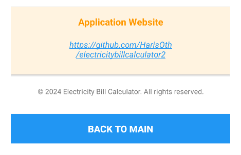

#  Electricity Bill Calculator 

Android application for calculating monthly electricity bills. Developed for ICT602 Mobile Technology assignment.

##  Features
- **Calculate Electricity Bill**
- **Month Selection** (January - December)
- **Adjustable Rebate** (0% - 5%)
- **Local Database Storage** using SQLite
- **Detailed View**
- **User-Friendly Interface**

##  Architecture
- **Language**: Java
- **Minimum SDK**: API 21 (Android 5.0)
- **Database**: SQLite (Local/Offline)
- **Architecture**: MVC Pattern
- **Tools**: Android Studio, Git, GitHub

##  Tariff Calculation Method
| Block | Rate (sen/kWh) |
|-------|----------------|
| 1-200 kWh | 21.8 |
| 201-300 kWh | 33.4 |
| 301-600 kWh | 51.6 |
| 601-900+ kWh | 54.6 |

**Formula**: `Final Cost = Total Charges - (Total Charges × Rebate %)`

##  Application Screenshots

| | | |
|-|-|-|
| **1. App Icon**  | **2. Main Screen**  | **3. History List**  |
| **4. Bill Details**  | **5. About Page**  | **6. GitHub Link in About Page**  |

**1. App Icon** - Application logo and splash screen  
**2. Main Screen** - Input month, electricity units and adjust rebate (0-5%)  
**3. History List** - All saved calculations displayed in chronological order  
**4. Bill Details** - Complete breakdown showing month, units, charges, rebate and final cost  
**5. About Page** - Student information including name, ID, course details  
**6. GitHub Link** - Clickable URL that opens the application's GitHub repository

##  Installation & Usage
1. On GitHub, click **"Code"** → **"Download ZIP"**
2. Extract the ZIP file on your computer
3. Open Android Studio → **"Open"** → Select the extracted folder
4. Wait for Gradle sync to complete
5. Click **Run** (▶) button to launch on emulator/device
