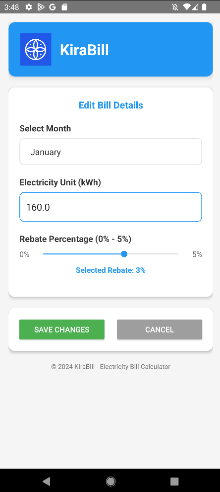
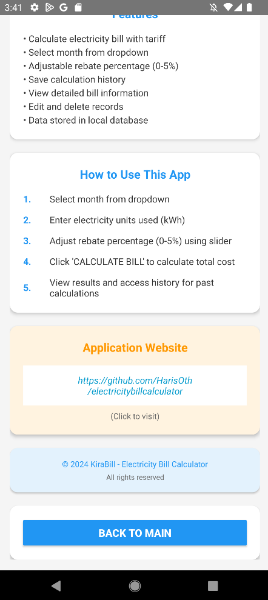

# KiraBill - Electricity Bill Calculator

## Overview
KiraBill is a Android application designed for calculating monthly electricity bills. Developed as a mobile technology assignment, this app showcases practical implementation of Android development concepts with a focus on user experience and data management.

## Features
- **Accurate Bill Calculation** - Uses standard electricity tariffs for precise calculations
- **Intuitive Month Selection** - Dropdown interface for easy month selection
- **Dynamic Rebate Adjustment** - Slider for 0% to 5% rebate with real-time updates
- **Local Data Storage** - SQLite database for offline access
- **Complete History Tracking** - View all past calculations
- **Edit & Delete Functionality** - Full CRUD operations for managing records
- **Professional UI Design** - Card-based material design interface
- **Student Information Section** - Includes academic details and project information

## Architecture
- **Development Language**: Java
- **Minimum SDK**: API 21 (Android 5.0 Lollipop)
- **Database**: SQLite (Local Storage)
- **Design Pattern**: Model-View-Controller (MVC)
- **Development Environment**: Android Studio
- **Version Control**: Git & GitHub

## Tariff Calculation
| Consumption Block | Rate (RM/kWh) | Description |
|------------------|---------------|-------------|
| **First 200 kWh** | 0.218 | Base residential rate |
| **Next 100 kWh** (201-300) | 0.334 | Medium consumption tier |
| **Next 300 kWh** (301-600) | 0.516 | High consumption tier |
| **Above 600 kWh** (601+) | 0.546 | Maximum consumption tier |

**Calculation Formula**:  
`Total Charges = Sum of (Block Usage × Block Rate)`  
`Final Cost = Total Charges - (Total Charges × Rebate Percentage / 100)`

## 📸 Application Screens

### Main Interface
| Splash Screen | Main Page |
|-------------|------------------|
|  |  |

### Data Management
| History Overview | Bill Details | Edit Record |
|-----------------|--------------|-------------|
|  |  |  |

### Information & About
| About Section | GitHub Integration |
|---------------|-------------------|
|  |  |

## Installation

### Method 1: Android Studio
1. Click **"Code"** → **"Download ZIP"** on GitHub
2. Extract the downloaded ZIP file
3. Open **Android Studio** → Click **"Open"**
4. Select the extracted project folder
5. Wait for Gradle sync to complete
6. Connect device or start emulator
7. Click **Run** (▶) to install and launch

### Method 2: Git Clone
```bash
git clone https://github.com/HarisOth/electricitybillcalculator2.git
cd electricitybillcalculator2
# Open in Android Studio
